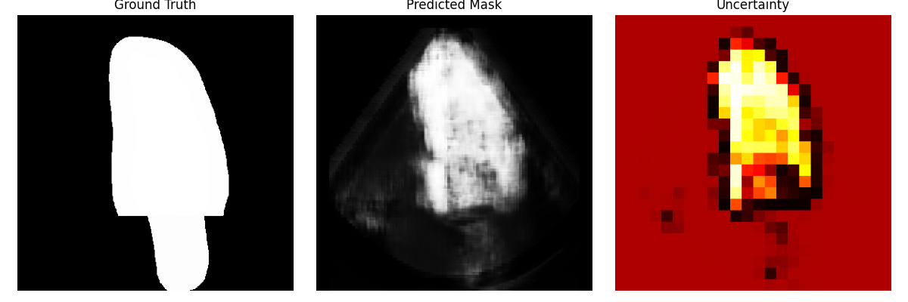

# CRISP-Based Uncertainty Estimation for Medical Image Segmentation
## Overview:
This project implements uncertainty estimation for medical image segmentation using CRISP (Contrastive Representation for Image Segmentation Prediction) with a U-Net segmentation model.
The goal is to improve model reliability in medical imaging by identifying regions where the model is uncertain about its predictions.

## Pipeline:
Medical Image
      ↓
U-Net Segmentation
      ↓
Predicted Mask
      ↓
CRISP Latent Space
      ↓
Uncertainty Estimation
      ↓
Evaluation & Visualization

## Example Output
Below are some examples from the model:

Left: Ground truth mask
Middle: Predicted mask from U-Net
Right: Uncertainty heatmap from CRISP
Bright regions indicate high uncertainty.

## Project structure
CRISP_Project/
│
├── data/
│   ├── train/
│   │   ├── images/
│   │   └── masks/
│   │
│   └── test/
│       ├── images/
│       └── masks/
│
├── models/
│   ├── unet.py
│   |── encoders.py
|   └──projection.py
│
├── utils/
│   └── dataset.py
|
|── training/
|    └──train.py
│    └──loss.py
|
├── predicted_masks/
├── predicted_uncertainty/
├── results/
│
├── train_unet.py
├── build_latent_space.py
├── predict_masks.py
├── predict_uncertainty.py
├── visualize_and_evaluate.py
│
└── README.md

## Installation
Clone the repository:
git clone https://github.com/YOUR_USERNAME/crisp-uncertainty-segmentation.git
cd crisp-uncertainty-segmentation

Install dependencies:
pip install torch torchvision numpy opencv-python matplotlib scikit-learn

## Training the Segmentation Model

Train the U-Net model:

python train_unet.py

Output:

unet_model.pth
Building CRISP Latent Space

Run:

python build_latent_space.py

Output:

latent_space.pt
crisp_model.pth
Predict Segmentation Masks
python predict_masks.py

Output:

predicted_masks/
Compute Uncertainty Maps
python predict_uncertainty.py

Output:

predicted_uncertainty/
Evaluation and Visualization

Run:

python visualize_and_evaluate.py

This computes:

Dice Score

Uncertainty vs Error Correlation

Mutual Information

Expected Calibration Error (ECE)

Results and visualizations are saved in:

results/
Example Metrics

From current experiments:

Average Dice Score: 0.8354
Average Correlation (Uncertainty vs Error): 0.3040
Average Mutual Information: 0.7863
Average ECE: 0.2458

The same training pipeline has been tried on Covid-19 CT scan dataset
Dataset link: https://www.kaggle.com/datasets/nguyentienda32143/covid-19-ct-lung-and-infection-segmentation
Metrics:
Correlation : 0.2468
Mutual Information: 0.6234
ECE: 0.2312
Some visualizations:

